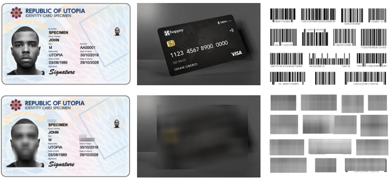

# Redactify - an AI, privacy-centric assistant
Redactify is a mobile application that aims to protect users' privacy in the materials posted online by performing redaction on areas of images/videos that potentially contain sensitive information such as Personal Identifiable Information (PII). Powered by Computer Vision Deep Learning models, it aims to position itself as as protective layer for TikTok users to filter out sensitive information before uploading a post onto the platform, keeping users safe from potential data leakages and threats revolving their PII.

**Personal Identifiable Information (PII) is any data that can be used to identify a specific person, either directly or indirectly

## Problem Statement
This project was done as part of TechJam 2025, following the track: *7. Privacy Meets AI: Building a Safer Digital Future* (AI for Privacy).

As AI technologies rapidly integrate into our daily lives, it is becoming increasingly important to be mindful of the things we post online which may compromise our privacy. 

## Features
- Option to capture image/video from phone camera or upload existing media from phone gallery.
- Flexiblity of choosing the type of PII to filter before sending image/video for processing.
- Output image/video is blurred, protecting the user from leaking their sensitive information online. 
- Filters out PII including, but not limited to, faces, bar codes, credit cards, passwords, emails and zipcodes. 

## Examples
The following examples show the kinds of sensitive PII that are redacted from the user's input images:

## User Flow
1. In the app's homepage, user chooses between (a) upload and (b) capture.
2. User performs the uploading/capturing of the image/video.
3. User reviews image/video.
4. User chooses types of sensitive information to redact from image/video by selecting from the dropdown menu.
5. User confirms decision and presses the button to send.
6. After a short moment, the resulting redacted image/video is rendered onto the screen, allowing the user to save the redacted image/video to their phone storage.

## Tech Stack
- Frontend: React Native with Expo
- Backend: FastAPI
- ML: OpenCV, HuggingFace
- Libraries: [PP-OCR](https://github.com/PaddlePaddle/Paddle) (Text Detection & Text Recognition), [YOLOv11](https://docs.ultralytics.com/models/yolo11/) (Face, Bar Code, Credit Card detection)

